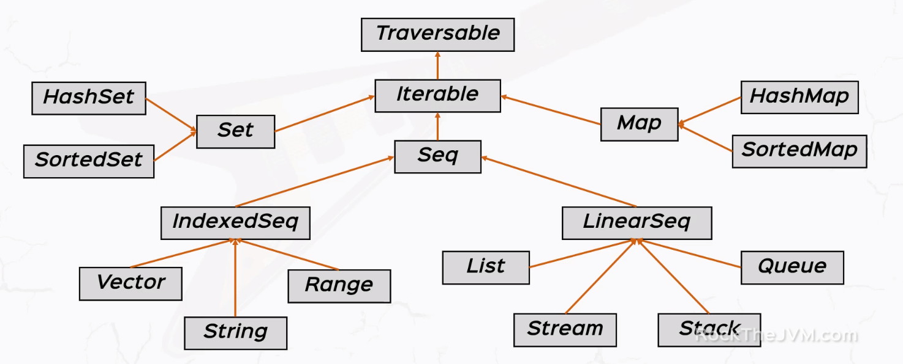
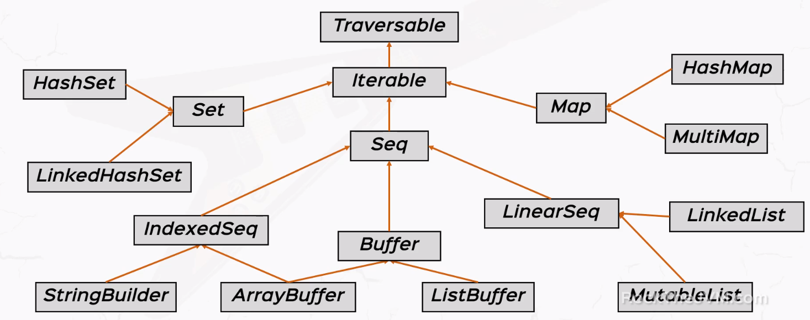

# Collections.

* Scala offers both mutable & immutable collections:
  * Mutable collections can be changed in place.
  * Immutable collections cannot be changed.
  
* Immutable collections are found in the _scala.collections.immutable_ package.

* Mutable collections are found in the _scala.collections.mutable_ package.

* The traversable is the "mother" of all collections, it offers a great variety of methods:
  * maps: map, flatMap, collect
  * conversions: toArray, toList, toSeq
  * size info: isEmpty, size, nonEmpty
  * tests: exists, forall
  * folds: foldLeft, foldRight, reduceLeft, reduceRight
  * retrieval: head, find, tail
  * string ops: mkString